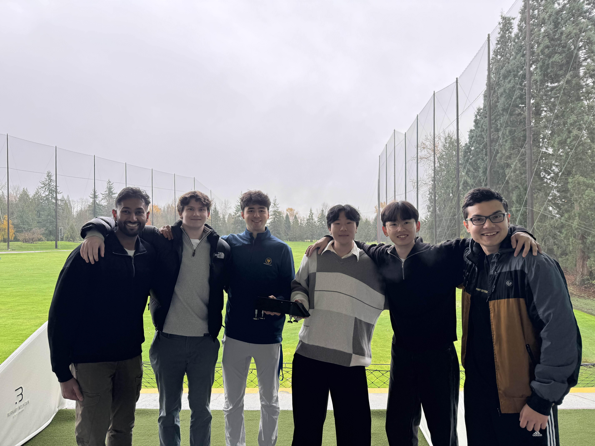
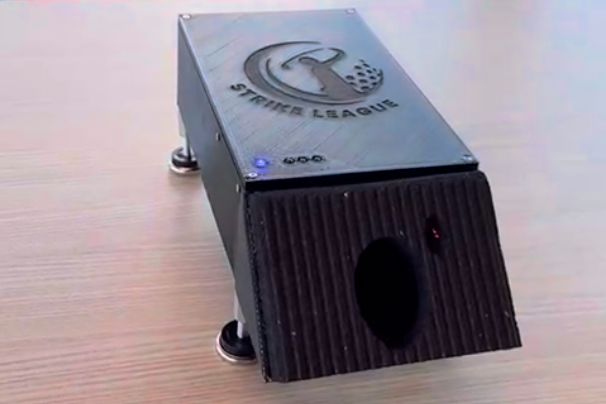
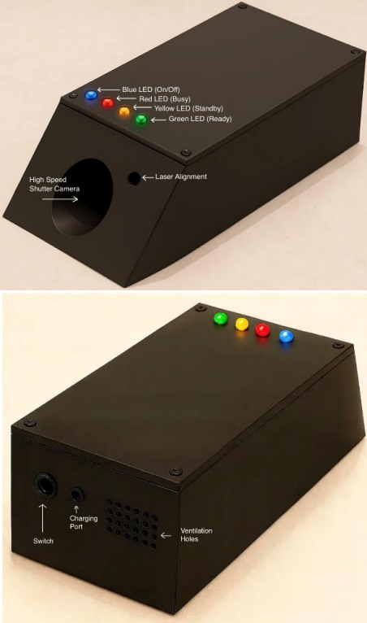
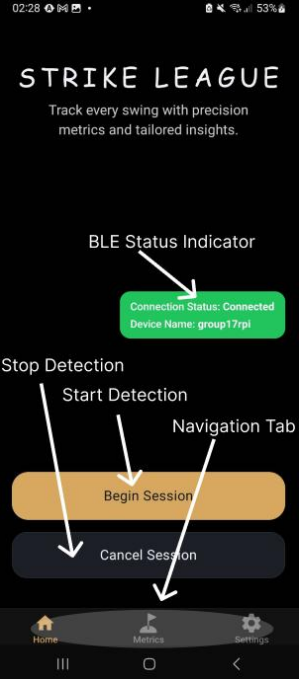
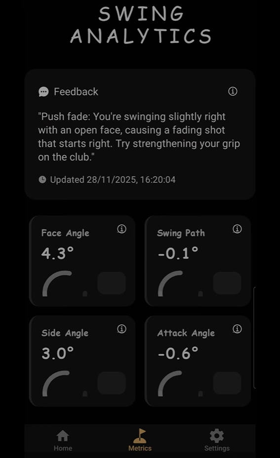

# DriveWise Launch Monitor

**To simplify swing improvement for golfers of all levels.**

A computer-vision–powered golf launch monitor that uses fiducial marker tracking, deep learning models, and Bluetooth-connected mobile telemetry to deliver high-fidelity shot metrics in real time.

---

## Demo

[](https://www.youtube.com/shorts/q7HvDcgbwZI)

**Watch the complete system in action** (click above or [view on YouTube](https://www.youtube.com/shorts/q7HvDcgbwZI))

For a detailed walkthrough of the prototype and system architecture, see the [informative technical overview](https://youtu.be/vlnLZo6ssWk).

---

## Features

- **Real-time ball and club tracking** using YOLOv8-based deep learning models optimized for edge devices
- **High-fidelity swing metrics** including face angle, swing path, attack angle, and side angle computed from video analysis
- **Fiducial marker tracking** for precise club movement tracking in real-world environments
- **Bluetooth Low Energy (BLE) GATT service** for seamless device-to-mobile communication with minimal latency
- **Cross-platform mobile app** (iOS and Android) providing live feedback, session history, and detailed analytics
- **Hardware-optimized inference** on Raspberry Pi 5 with TensorFlow Lite runtime for efficient processing
- **Modular system architecture** separating capture, preprocessing, inference, tracking, and output for easy extension
- **Rule-based feedback engine** that translates raw metrics into actionable coaching insights
- **Status LED indicators** for visual feedback on device state (capture, processing, ready, error)
- **Battery monitoring** and power management for portable operation

---

## Project Context

**Institution**: Simon Fraser University  
**Course**: ENSC 405/440 Capstone Design  
**Year**: 2025

This project was developed as a complete capstone system, spanning computer vision, embedded systems, wireless communications, backend integration, mobile app development, and mechanical/electrical engineering.

---

## System Architecture

DriveWise is built as a modular pipeline:

```
Camera Input
  → Frame Capture (Raspberry Pi Camera Module)
  → Preprocessing (OpenCV, NumPy)
  → ML Inference (YOLO + TensorFlow Lite)
  → Tracking & Physics (SciPy, NumPy)
  → Rule-Based Feedback Engine
  → BLE Transmission to Mobile App
```

For detailed architecture, see [**architecture.md**](docs/architecture.md).

---

## Technical Highlights

### Computer Vision
- **Ball and club detection** using YOLOv8 models trained on diverse golf swing datasets
- **Real-time tracking** across video frames with sub-pixel precision
- **Fiducial marker detection** (ArUco) for automatic calibration and coordinate transformation
- **Adaptive preprocessing** to handle varied lighting and environmental conditions

### Embedded Systems
- **Raspberry Pi 5** as the primary compute platform
- **Camera module integration** with configurable frame rates and exposure control
- **Efficient model inference** using TensorFlow Lite Runtime
- **Real-time processing pipeline** optimized for 450+ FPS video capture

### Wireless & Mobile
- **Bluetooth Low Energy (BLE) GATT** service for device-to-app communication
- **Symmetric notification protocol** for sending metrics and feedback to mobile clients
- **Low-latency data transmission** optimized for real-time user experience
- **Cross-platform mobile app** (iOS and Android) with intuitive UI/UX

### Hardware & Electronics
- **Power-efficient design** with battery integration and charging circuits
- **Custom enclosure** optimized for durability, portability, and thermal management
- **Status LED feedback** (yellow = capturing, green = processing, red = error, off = ready)
- **Force-mitigated enclosure** for durability during outdoor use

---

## Getting Started

### Prerequisites

- Raspberry Pi 5 (or compatible Linux system) with Bluetooth support
- Pi Global Shutter Camera Module
- Mobile device (iOS or Android) with Bluetooth LE support
- DriveWise mobile app installed
- Python 3.10+

### Quick Setup

For a complete setup walkthrough, see [**setup.md**](docs/setup.md).

For detailed operation and usage instructions, see [**user_manual.pdf**](docs/user_manual.pdf).

**To run the system:**

1. Clone the repository:
   ```bash
   git clone https://github.com/Capstone17/drivewise-launch-monitor.git
   cd drivewise-launch-monitor
   ```

2. Install dependencies:
   ```bash
   python3 -m venv venv
   source venv/bin/activate
   pip install -e .
   ```

3. Pair your mobile device via Bluetooth (see [user_manual.pdf](docs/user_manual.pdf))

4. Open the mobile app and tap "Start Analysis" to begin capturing swings

**Note**: This project is built for specific Raspberry Pi OS software and hardware configurations. Full setup is complex; if you have questions on replication or deployment, please reach out to [kremlern@gmail.com](mailto:kremlern@gmail.com).

---

## Documentation

| Document | Purpose |
|---|---|
| [**user_manual.pdf**](docs/user_manual.pdf) | Complete user guide for hardware setup, calibration, and operation |
| [**final_report.pdf**](docs/final_report.pdf) | Capstone project technical report with system design and results |
| [**architecture.md**](docs/architecture.md) | Detailed system architecture, component responsibilities, and data flow |
| [**api.md**](docs/api.md) | Bluetooth GATT service specification and API reference for mobile integration |
| [**setup.md**](docs/setup.md) | Installation and environment setup for developers |

---

## Team & Attribution

### Mobile Application Developer – Ryan Martin
Responsible for building the user-facing mobile application for device interaction and data visualization.
- Designs and develops the mobile app for both iOS and Android platforms
- Creates a clean, intuitive UI/UX for real-time swing metrics and session summaries
- Implements wireless connectivity via BLE to pair with the launch monitor hardware
- Optimizes performance for low-latency updates during live tracking sessions
- Maintains and updates the app based on user feedback and new feature requests

### Backend Engineer – Noah Kremler
Handles data processing, storage, and interfaces between hardware, app, and cloud.
- Integrates backend APIs to display ball-flight data and analytics
- Optimizes and deploys computer vision models for the Raspberry Pi platform, including quantization, model export (e.g., TFLite/ONNX), batch sizing, and pipeline tuning.
- Optimizes backend performance to support low-latency data transmission from the device
- Develops a rule-based AI feedback engine to provide actionable swing insights
- Integrates detection output with backend systems for analytics and visualization

### Computer Vision Specialist – Daniyar Umuraliyev
Focuses on ball and club tracking, swing analysis, and feedback algorithms.
- Designs and trains YOLOv8-based models for high-speed ball and club detection
- Implements and deploys real-time tracking algorithms optimized for the Raspberry Pi 5 hardware
- Tunes computer vision models to handle varied lighting, angles, and golf environments
- Collaborates with backend and wireless engineers to ensure synchronized data capture

### Wireless Communications Engineer – Hugo Kwon
Responsible for connectivity between the device and external systems for real-time data transfer.
- Develops reliable Bluetooth protocols for device-to-app communication
- Optimizes data transmission for minimal latency during live tracking sessions
- Designs a robust pairing and connection process for user-friendly setup
- Handles error detection and recovery for dropped or unstable connections
- Works with the backend engineer to ensure seamless API data flow

### Mechanical Engineer (Hardware + Enclosure) – Husain Kanthawala
Oversees the physical components, circuitry, enclosure design of the device.
- Selects components for power efficiency, performance, and cost optimization
- Develops power management systems, including battery integration and charging circuits
- Builds and tests prototypes to ensure reliable operation in real-world conditions
- Designs the physical enclosure for durability, portability, and thermal management

### Electronics Engineer (Firmware + Enclosure) – Sungmin Lee
Responsible for the circuit and enclosure design of the physical UI of the device.
- Optimizes the enclosure design to contain LEDs, calibration equipment, and an improved battery
- Develops firmware to send a compact battery's status to the app
- Designs solutions for force mitigation to improve the durability of the enclosure
- Builds the circuitry and firmware to control LED indicators for device status

---

## Project Images











---

## Dependencies

Key dependencies include:

- **OpenCV** (`opencv-contrib-python`) – Computer vision and image processing
- **TensorFlow & TFLite** (`tensorflow`, `tflite-runtime`) – Deep learning inference
- **ONNX & ONNX Runtime** (`onnx`, `onnxruntime`, `onnx2tf`) – Model conversion and execution
- **NumPy & SciPy** (`numpy`, `scipy`) – Numerical computing and physics calculations
- **Matplotlib** (`matplotlib`) – Data visualization and debugging
- **Dbus & Bluez** (`python3-dbus`, system packages) – Bluetooth Low Energy support

For the complete list and versions, see [**pyproject.toml**](pyproject.toml).

---

## License

This project is licensed under the MIT License. See [LICENSE](LICENSE) for details.

---

## Contributing

Contributions and improvements are welcome. For guidelines, see [CONTRIBUTING.md](CONTRIBUTING.md) (if available) or contact the team.

---

## Contact & Support

For questions about setup, deployment, or the technical architecture, please reach out to:

**Noah Kremler** – [kremlern@gmail.com](mailto:kremlern@gmail.com)

---

**DriveWise** – Simplifying swing improvement for golfers everywhere.