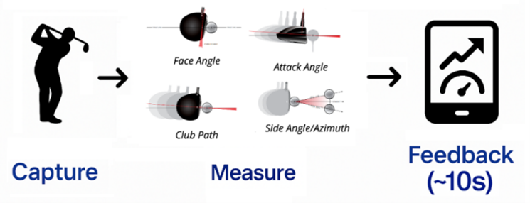

# DriveWise Launch Monitor – Architecture

## 1. Overview

DriveWise is an open-source golf launch monitor that uses a high-speed global shutter camera and machine-learning models to measure ball and club parameters such as swing path, face angle, attack angle, and side angle. The monitor uses these metrics to predict the outcome of the shot, and give the golfer coaching tips to improve their next swing. The system processes high-frame-rate video of a golf swing, detects the ball and club, and estimates key metrics from their motion. The primary target environment is a Linux-based machine (e.g., desktop or single-board computer) with a connected camera and sufficient CPU/GPU resources for real-time or near real-time inference.

At a high level, the system consists of:
- A capture pipeline to acquire frames from a camera.
- A preprocessing and inference pipeline built on OpenCV, TensorFlow Lite, and related libraries.
- A tracking and metrics layer that turns model outputs into physical launch parameters.
- A presentation layer that displays results (e.g., mobile app UI).



## 2. High-Level Architecture

The architecture is organized around a unidirectional data flow from the camera to the output metrics:

```text
Camera
  -> Frame Capture
  -> Preprocessing
  -> Model Inference (TFLite)
  -> Tracking & Physics
  -> Metrics & Output (App UI)
```

Each stage is implemented as a separate module or group of modules in the codebase. This separation keeps the system easier to reason about, test, and extend (for example, swapping models or adding new sensors).

## 3. Components

### 3.1 Capture

**Responsibilities**
- Initialize and configure the camera (resolution, crop, frame rate, exposure).
- Grab frames from the video stream and hand them off to the preprocessing stage.
- Provide basic error handling (camera not available, video file corrupted, etc.).

**Key Points**
- Built on rpicam's video capture APIs.

### 3.2 Preprocessing

**Responsibilities**
- Convert raw frames into the format expected by downstream models (e.g., resize, crop, normalize).
- Optionally perform background subtraction, ROI cropping, or simple filtering to reduce noise.
- Provide consistent input shapes and types to inference backends.

**Key Points**
- Uses `opencv-contrib-python`, `numpy`, and `scipy` for image manipulation and basic numerical operations.
- Encapsulates all image-shape and color-space assumptions in one place.

### 3.3 Model Inference

**Responsibilities**
- Load and manage machine-learning models (TFLite).
- Run inference on preprocessed frames to detect ball and club positions, keypoints, or segmentation masks.
- Provide a uniform interface for models regardless of backend.

**Key Points**
- Uses `tensorflow` and `tflite-runtime` for TensorFlow and TFLite models.
- Designed to make it relatively easy to swap in improved models without changing other parts of the pipeline.

### 3.4 Tracking and Physics

**Responsibilities**
- Track ball and club across consecutive frames using model outputs.
- Compute derived metrics such as:
  - Initial 3D ball velocity vectors.
  - Horizontal launch angle.
  - Initial 3D club velocity vectors.
- Apply smoothing and filtering to reduce noise (e.g., outlier rejection, basic filtering).

**Key Points**
- Relies heavily on `numpy` and `scipy` for numerical computations and curve fitting.
- Encapsulates domain-specific golf assumptions (e.g. horizontal launch angle can be derived from a combination of face angle, swing path, and gear effect).

### 3.5 Bluetooth and Mobile App Integration

**Responsibilities**
- Manage the Bluetooth connection between the launch monitor and the mobile app.
- Serialize and transmit shot metrics (e.g., side angle, club path) to the phone in real time.
- Handle reconnection logic and basic error handling when the connection is lost.

**Key Points**
- Runs alongside the main processing pipeline and listens for new shot results from the metrics module.
- Uses a lightweight message format (JSON) so the mobile app can easily parse and display data.
- Designed so the core pipeline can run without Bluetooth; if no phone is connected, shots are still processed locally.

### 3.6 Presentation Layer (UI / API)

**Responsibilities**
- Present computed metrics to the user via a mobile application interface.
- Optionally log data for later analysis or integrate with external simulators.

**Key Points**
- Uses `matplotlib` for visualizations during development and debugging.
- May provide an API or simple data output format for other tools to consume.

## 4. Data Flow and Key Execution Path

A typical shot detection and analysis flow:

1. **Idle / Ready**  
   The system waits in a ready state, continuously capturing frames from the camera.

2. **Swing & Ball Launch**  
   The player swings, and the camera captures a sequence of frames containing the club and ball.

3. **Preprocessing**  
   Frames are resized, cropped, and normalized to match the input specification of the ML models.

4. **Inference**  
   Each frame (or selected frames) is passed to the model(s) to detect the ball and club and produce position or keypoint outputs.

5. **Tracking & Physics**  
   The system links detections across frames, computes velocities and trajectories, and estimates side angle, swing path, face angle, and attack angle.

6. **Coaching Tips Generation**  
   Based on the computed metrics, the system generates coaching tips to help the golfer improve their swing.

7. **Output**  
   Results are displayed or logged, and the system returns to the ready state for the next shot. If a mobile device is connected over Bluetooth, the shot metrics are also sent to the app for real-time visualization.

This flow can be implemented either in a single main loop or as a small pipeline of cooperating components, depending on performance and complexity requirements.

## 5. Technology Choices

- **Python**: Rapid development, rich ecosystem for computer vision and scientific computing.
- **OpenCV (`opencv-contrib-python`)**: Provides cross-platform camera access and a wide range of image processing primitives.
- **ONNX / TensorFlow / TFLite (`onnx`, `onnxruntime`, `onnx2tf`, `tensorflow`, `tflite-runtime`)**: Flexible support for running models on a broad range of hardware, with the option to export and optimize models.
- **NumPy / SciPy (`numpy`, `scipy`)**: Efficient numerical and scientific computing for tracking and physics calculations.
- **Matplotlib (`matplotlib`)**: Data visualization during development, debugging, and analysis.
- **smbus2 (`smbus2`)**: I2C communication with external sensors (if used).

These choices balance developer productivity, community support, and the ability to run on resource-constrained hardware.

## 6. Deployment and Runtime Environment

- **Target Platform**: Linux-based environment (desktop or single-board computer) with Python 3.10+ and a compatible camera.
- **Dependencies**: Managed via `pyproject.toml` and installed with `pip install .` or `pip install -e .` in a virtual environment.
- **Entry Point**: A main script (for example, `main.py` or an equivalent module) that wires together capture, inference, tracking, and output.
- **Configuration**: Basic configuration can be handled via command-line arguments, environment variables, or a simple config file (e.g., YAML/TOML/JSON) specifying camera index, resolution, and model paths.
- **Bluetooth**: Requires a host with Bluetooth support and a paired mobile device running the companion app to receive shot data.


## 7. Extensibility and Future Work

Potential extension points:

- **Additional Models**: Support new models (e.g., different architectures or tasks) by adding model loader/inference adapters that conform to the existing inference interface.
- **Multiple Cameras**: Extend the capture and tracking pipeline to ingest and synchronize multiple camera feeds for more accurate 3D measurements.
- **Richer Physics**: Incorporate more advanced physics and spin modeling for improved velocity estimates.
- **Simulator Integration**: Add adapters to send shot data directly to golf simulator software or other third-party tools.
- **UI Enhancements**: Build richer interfaces (desktop or web) for configuration, live feedback, and historical analysis.

The goal of this architecture is to keep the core pipeline clear and modular so new ideas, models, and hardware can be integrated without rewriting the entire system.